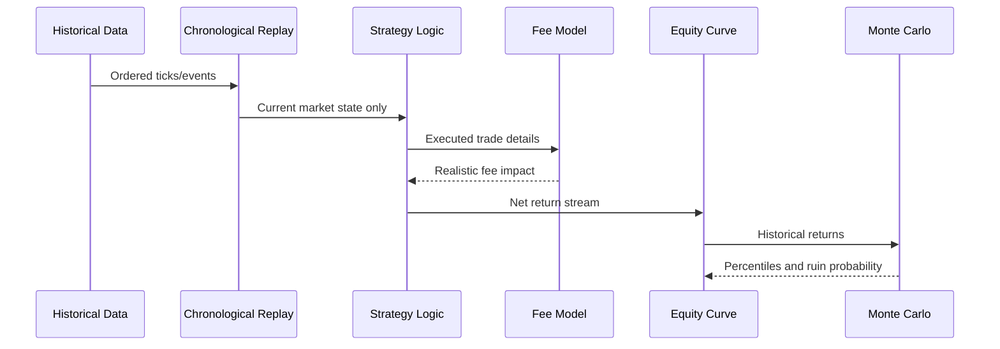
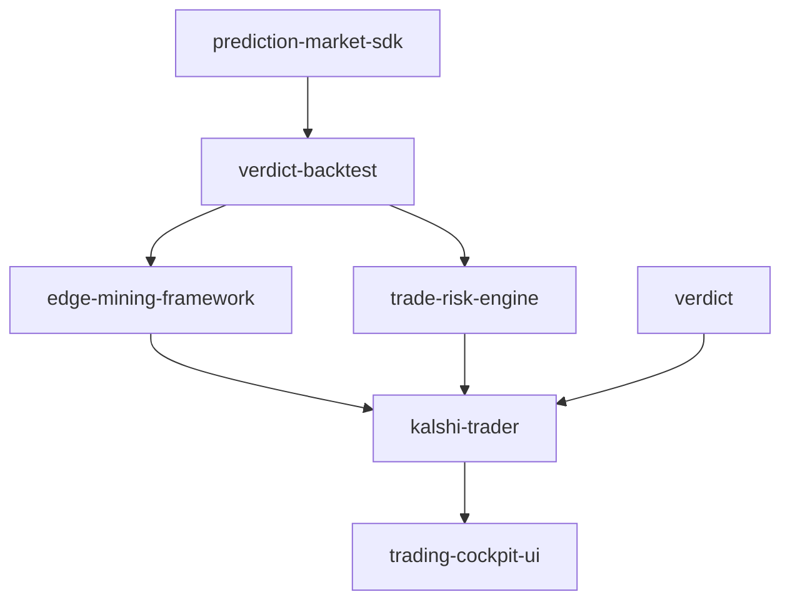

# Architecture

`verdict-backtest` provides focused primitives that can be composed by larger
trading research systems. The compatible Python import namespace is
`backtest_harness`.

## Core modules

| Module | Responsibility |
| --- | --- |
| `backtest_harness.fee_models` | Protocol and implementations for exchange fee calculations. |
| `backtest_harness.monte_carlo` | Equity-path sampling and risk percentile estimation. |
| `backtest_harness.analytics` | Tear-sheet statistics and walk-forward index splitting. |
| `backtest_harness.provider_receipts` | Deterministic, privacy-safe evaluation receipts (ADR-021). |
| `backtest_harness.evidence` | Counterfactual provider evidence and Core-compatible export (BACK-001). |

## Data flow

## Ecosystem context

## Counterfactual evidence (BACK-001)

`backtest_harness.evidence` exposes deterministic, counterfactual backtest
evaluations as verification evidence compatible with Verdict Core's
`VerificationResult` and `EvidenceChainLink` contracts:

- **`run_counterfactual`** — Seeded, reproducible evaluation of a historical
  returns series. Records inputs, random seed, fee model, code version, and
  dataset reference in a receipt whose `evidence_refs` bind it to the canonical
  hash of produced results (Monte Carlo, tear-sheet, walk-forward, fees). Pure
  in-process math; no network, no live execution.
- **`build_failure_evidence`** — Explicit receipts for failure, timeout,
  denied, cancelled, and unknown states. The absence of results is auditable;
  fabricated success is impossible because the bundle carries none.
- **`to_verification_result`** — Export as a Core `VerificationResult` payload.
  Status derives only from the recorded outcome; a non-success outcome can
  never map to `"passed"`, and advisory detail fields cannot override the
  mapping.
- **`to_evidence_chain_link`** — Export as a Core `EvidenceChainLink` payload.
  All decision-authority fields (decision, policy, envelope hash, model,
  timestamp) must be supplied by the caller; this provider is evidence-only and
  cannot grant or fabricate authority.

The receipts implement ADR-021 (Deterministic Provider Evaluation Receipts):
identical evaluation inputs produce identical `inputs_hash` and `config_hash`,
enabling deterministic replay. Sensitive keys (`api_key`, `authorization`,
`password`, `secret`, `token`) are rejected at the receipt boundary.

## Design principles

- **Auditability over cleverness**: Backtest assumptions should be inspectable.
- **Determinism in tests**: Randomized simulations must be seeded or monkeypatched.
- **Composable boundaries**: Fee models and simulation utilities should remain easy to use independently.
- **No hidden live trading**: This package must not place orders or call broker APIs.
